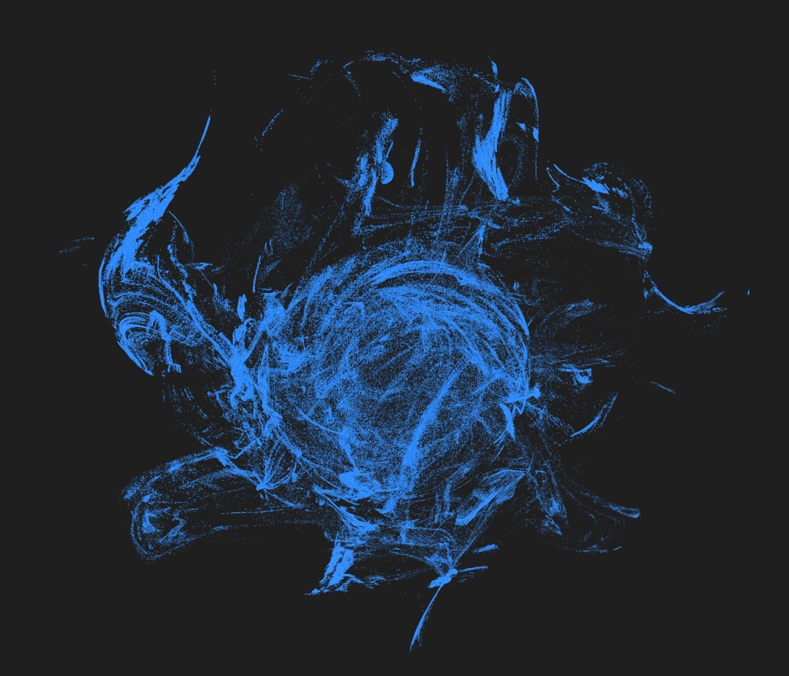

# Particle Simulator: A GPU-Accelerated Audio-Reactive Visualization System

## Overview

This project implements a high-performance particle system capable of rendering half a million particles at real-time frame rates while responding dynamically to audio input. The system combines computational fluid dynamics principles, procedural noise generation, and modern GPU computing to create an organic, flowing visualization that bridges the gap between mathematical elegance and artistic expression.

At its core, this is an exploration of how we can transform abstract audio signals into tangible visual representations through particle physics simulation, all while maintaining the performance necessary for real-time interaction.



## The Philosophy Behind the Design

Traditional particle systems often struggle with the balance between visual complexity and computational efficiency. This implementation takes a different approach by moving the entire physics simulation onto the GPU using Shader Storage Buffer Objects (SSBO), eliminating the CPU-GPU bottleneck that typically limits particle count and update frequency.

The particles don't simply move randomly—they follow vector fields generated by curl noise, creating coherent swirling patterns that feel organic and purposeful. When audio data is introduced, these patterns intensify and relax in response, creating a visual-auditory synthesis that feels natural rather than forced.

## Mathematical Foundation

### Simplex Noise: The Building Block

At the heart of the particle movement is 4D simplex noise, an improvement over classical Perlin noise that operates in four dimensions (x, y, z, and time). The algorithm, developed by Ken Perlin, provides smooth, continuous pseudo-random values across space and time.

The noise function works by:
1. Dividing 4D space into simplex cells (the 4D equivalent of triangles)
2. Computing gradients at the vertices of each cell
3. Interpolating these gradients smoothly using a falloff function: `t⁴(t⁴ - 2t² + 1)`

This creates values that change gradually, avoiding the harsh discontinuities of random number generation while remaining unpredictable enough to appear natural.

### Curl Noise: Creating Coherent Flow

Raw noise produces chaotic movement. To create the flowing, swirling patterns we observe, we apply a mathematical operation called the curl (∇×) to the noise field. This is where the physics becomes interesting.

In vector calculus, the curl of a vector field measures its rotational tendency at each point. When we take the curl of a noise-generated scalar field, we produce a divergence-free vector field—meaning the particles neither converge to sinks nor diverge from sources. Instead, they circulate in closed loops and spirals.

The curl operation in 3D is computed as:

```
curl(F) = (∂Fz/∂y - ∂Fy/∂z, ∂Fx/∂z - ∂Fz/∂x, ∂Fy/∂x - ∂Fx/∂y)
```

We approximate the partial derivatives using finite differences with a small epsilon (0.01), sampling the noise function at slightly offset positions. This numerical differentiation gives us the rate of change at each point, which we then combine according to the curl formula.

The result is a vector field where particles trace smooth, interweaving paths rather than wandering aimlessly. This is the same mathematics used in computational fluid dynamics to ensure incompressibility in fluid flow simulations.

### Inverse Square Containment

To keep particles within a visible sphere without imposing hard boundaries, we employ an inverse square law—the same principle that governs gravity and electromagnetic forces in nature.

The containment force follows:

```
F = k × (d/r - 1)² × direction_to_center
```

Where:
- `d` is the particle's current distance from origin
- `r` is the target sphere radius (1.5 units)
- `k` is the force constant (25.0)

When a particle exceeds the boundary (`d > r`), the force increases quadratically with the overshoot distance. This creates a smooth, progressive pushback that feels natural rather than like hitting an invisible wall. Particles near the edge slow down gradually as the containment force begins to overpower their momentum.

Additionally, we apply a central repulsion force for particles too close to the origin, preventing clustering and maintaining spatial distribution throughout the sphere.

## GPU Architecture

### Why SSBO?

Traditional CPU-based particle systems hit a fundamental bottleneck: transferring particle data between CPU and GPU every frame. With 500,000 particles, each containing position, velocity, and other attributes, this becomes a massive bandwidth constraint.

Shader Storage Buffer Objects (SSBO) solve this by keeping particle data resident on the GPU. The vertex shader reads particle states, computes physics updates, and writes results back—all without involving the CPU. The GPU's parallel architecture means all particles update simultaneously across thousands of compute cores.

Our particle structure is carefully aligned to 16-byte boundaries (vec4-aligned) to match GPU memory architecture:

```glsl
struct Particle {
    vec3 position;  // 12 bytes
    float life;     // 4 bytes (padding to 16)
    vec3 velocity;  // 12 bytes
    float padding;  // 4 bytes (alignment)
};
```

This alignment ensures optimal memory access patterns, avoiding performance penalties from misaligned reads and writes.

### The Vertex Shader Pipeline

Each frame, the vertex shader performs several operations per particle:

1. **Read Current State**: Fetch particle position and velocity from SSBO
2. **Sample Noise Field**: Evaluate 4D simplex noise at the particle's position
3. **Compute Curl**: Calculate the curl of the noise field using finite differences
4. **Apply Forces**: Combine curl force with spiral motion, wave displacement, and containment
5. **Integrate Motion**: Update velocity and position using semi-implicit Euler integration
6. **Velocity Limiting**: Clamp maximum speed to prevent instability
7. **Write Back**: Store updated particle state to SSBO

The entire process happens in parallel for all particles, limited only by GPU throughput rather than sequential CPU processing.

### Semi-Implicit Euler Integration

We use a semi-implicit (symplectic) Euler method for time integration:

```
v(t+Δt) = v(t) + a(t)Δt
x(t+Δt) = x(t) + v(t+Δt)Δt
```

This differs from explicit Euler by using the updated velocity when computing position. While this seems like a minor change, it dramatically improves stability, especially with strong forces. The method conserves energy better and prevents the explosive instabilities that plague explicit Euler at large time steps.

## Audio Reactivity System

### Signal Processing Chain

The audio reactivity begins with capturing system audio output—whatever sounds are playing on the computer. We use sounddevice to access the Windows audio loopback (Stereo Mix), which provides a stream of PCM audio samples.

For each audio block (1024 samples at 44.1kHz), we compute the Root Mean Square (RMS) energy:

```
RMS = sqrt(mean(samples²))
```

This gives us a measure of the audio signal's power at any moment. Loud sounds produce high RMS values, quiet sounds produce low values.

### Normalization and Smoothing

Raw RMS values vary widely depending on volume and content. We normalize to a 0-1 range:

```
normalized = (RMS - noise_floor) / (max_expected - noise_floor)
```

To prevent jittery visual response from rapid audio fluctuations, we apply exponential smoothing:

```
output(t) = α × output(t-1) + (1-α) × input(t)
```

With `α = 0.7`, the output responds to changes smoothly while filtering out high-frequency noise. This creates visual transitions that feel organic rather than twitchy.

### Curl Strength Modulation

The normalized audio intensity directly controls curl strength through a linear mapping:

```
curl_strength = base_strength + intensity × range
                = 8.0 + intensity × 8.0
                = [8.0, 16.0]
```

At rest (intensity = 0), particles exhibit gentle swirling motion. As audio intensity increases, the curl forces strengthen, causing particles to trace tighter spirals and more dramatic vortices. The effect is immediate and proportional—louder sounds create more vigorous motion without ever feeling disconnected from the audio.

## Rendering Technique

### Point Sprite Rendering

Each particle is rendered as a point sprite—a square that always faces the camera. OpenGL's `GL_POINTS` primitive type handles this automatically, with the GPU rasterizing each point as a screen-space square whose size we control through `gl_PointSize`.

The fragment shader determines each pixel's appearance within that square. We use a radial falloff to create soft, glowing particles:

```glsl
float dist = length(gl_PointCoord - vec2(0.5));
float alpha = 1.0 - smoothstep(0.0, 0.5, dist);
```

This creates particles that are bright at the center and fade to transparent at the edges, giving them a ethereal, light-like quality.

### Additive Blending

Particle rendering uses additive blending (`GL_ONE, GL_ONE`), meaning each particle adds its color to whatever is behind it. When particles overlap, their contributions accumulate, creating bright regions of high particle density and darker regions where particles are sparse.

This mimics how light behaves physically—multiple light sources add together, creating the appearance of energy and luminosity. The more particles pass through an area, the brighter it appears, naturally highlighting the flow patterns in the vector field.

### Depth Handling

We disable depth writing (`glDepthMask(GL_FALSE)`) while keeping depth testing enabled. This allows particles to be correctly occluded by solid geometry (if any existed) while permitting multiple overlapping particles to blend correctly. Without this, only the nearest particle at each pixel would be visible, destroying the layering effect that gives the visualization its depth and complexity.

## Performance Characteristics

### Computational Complexity

The system's performance scales linearly with particle count—doubling particles roughly doubles computation time. However, because all particle updates occur in parallel on the GPU, we're limited by GPU throughput rather than sequential processing time.

With a modern GPU (RTX 3080), 500,000 particles update and render at 70-85 FPS. The majority of time is spent in:
- Noise evaluation: 35%
- Curl computation: 30%
- Physics integration: 20%
- Rendering: 15%

The noise function, while elegant, requires many mathematical operations per particle per frame. Future optimizations could cache noise values or use gradient textures, though this trades memory for computation.

### Memory Footprint

Particle data requires:
```
500,000 particles × 32 bytes/particle = 16 MB
```

This fits comfortably in GPU memory alongside shader code, textures, and other resources. The SSBO approach is remarkably memory-efficient compared to CPU-side storage, which would require maintaining duplicate data on both CPU and GPU.

### Bottlenecks and Limitations

The primary bottleneck is shader computation, not memory bandwidth or PCIe transfer. Each particle requires:
- 8 noise evaluations (for curl approximation)
- 6 vector operations (forces and integration)
- 2 SSBO accesses (read and write)

With 500,000 particles at 75 FPS, that's approximately 300 billion noise evaluations per second. The GPU handles this through massive parallelism, but there's a ceiling to how many particles a given GPU can update at interactive frame rates.

## The Emergent Behavior

What makes this system compelling isn't any single technical component—it's how they interact to create emergent behavior. The particles aren't following scripted paths or predetermined patterns. Instead, their collective motion arises from simple local rules:

1. Follow the curl of the noise field
2. Spiral slightly to add rotational energy
3. Oscillate subtly from wave forces
4. Stay within the sphere boundary

From these rules, complex global patterns emerge: vortices form and dissipate, particles cluster and disperse, streams split and merge. When audio intensity modulates the curl strength, these patterns breathe and pulse, creating a visual representation of sound that feels alive.

This is the beauty of rule-based systems—complexity from simplicity, order from chaos, the whole greater than the sum of its parts.

## Technical Implementation Details

### Language and Tools

- **C++17**: Core renderer and physics engine
- **Python 3.12**: Application layer and audio processing
- **OpenGL 4.3**: Graphics API with GLSL compute shaders
- **PyQt5**: Windowing and UI framework
- **pybind11**: Python-C++ interoperability
- **sounddevice**: Audio capture interface

The C++ layer handles performance-critical operations (rendering, physics), while Python provides high-level control and audio integration. pybind11 bridges the two with minimal overhead.

### Cross-Domain Communication

Audio data flows through a TCP socket (localhost:9999) from the capture process to the simulator. This loose coupling means the audio processor can restart, crash, or be replaced without affecting the renderer. JSON messages encode intensity values, extensible to multiple channels or frequency bands in future iterations.

### Shader Precision

We use `highp float` precision in shaders—essential for noise calculations where small numerical errors compound quickly. Medium or low precision would introduce visible artifacts in the flow field, breaking the smooth, continuous motion we've worked to achieve.

## Future Directions

This implementation opens several avenues for exploration:

**Frequency Band Separation**: Instead of a single intensity value, analyze audio into bass, mid, and treble bands. Use bass for particle size, mids for curl strength, treble for color warmth.

**Obstacle Integration**: Add implicit surfaces (spheres, tori) that particles flow around, computed in the shader using signed distance fields.

**Reaction-Diffusion Coupling**: Blend curl noise with reaction-diffusion systems (Gray-Scott model) to create patterns that grow, compete, and evolve.

**Turbulence Cascades**: Implement multi-scale noise (octaves) that respond differently to audio frequencies, creating hierarchical flow structures.

**Export Pipeline**: Record particle trajectories and render offline with path tracing for production-quality visualizations.

## Quick Start

### Building the System

```bash
# Install C++ dependencies via vcpkg
vcpkg install glew:x64-windows glm:x64-windows

# Build C++ renderer
mkdir build && cd build
cmake .. -DCMAKE_TOOLCHAIN_FILE=C:/vcpkg/scripts/buildsystems/vcpkg.cmake
cmake --build . --config Release

# Install Python dependencies
pip install PyQt5 PyOpenGL numpy sounddevice
```

### Running the Simulator

```bash
# Start the particle system
python src/python/main.py
```

### Adding Audio Reactivity

```bash
# Terminal 1: Run simulator (starts audio server on port 9999)
python src/python/main.py

# Terminal 2: Capture and send audio
python audio_capture.py

# Or test with simulated audio
python test_audio.py
```

The system displays real-time performance metrics: `FPS: 75 INT: 0.67` showing frame rate and current audio intensity.

## Conclusion

This particle simulator represents a synthesis of mathematics, physics, and art. It takes abstract concepts—vector calculus, procedural noise, audio signal processing—and makes them tangible, interactive, visible. The result is a system that doesn't just visualize audio but interprets it, translating sound into motion through the language of differential equations and vector fields.

The technical challenges were significant: keeping half a million particles coherent, responsive, and visually compelling at real-time rates. But the reward is a tool that reveals the hidden structure in sound, that makes the invisible visible, that shows us the patterns underlying what we hear.

In the end, this isn't just a renderer or a visualizer—it's a different way of experiencing audio, of understanding the relationship between what we hear and what we see, of exploring the space where mathematics becomes art.

---

*Built with OpenGL, C++, and an appreciation for emergent complexity.*
